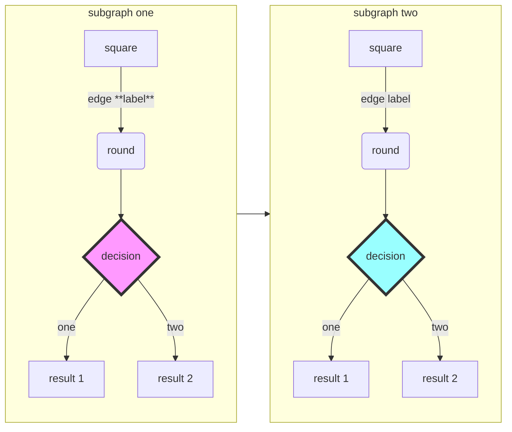

# Render `doc-level` library in [mermaid](https://mermaid.js.org/intro/) format

## `flowchart`

## Options to view rendered mermaid

### IDE plugins

| img | url |
| --- | --- |
 | [bierner.markdown-mermaid](https://marketplace.visualstudio.com/items?itemName=bierner.markdown-mermaid)

### Convert mermaid to SVG images

| img | url | description |
| --- | --- | --- |
|  | [mermaid-cli](https://www.npmjs.com/package/@mermaid-js/mermaid-cli) | Install as a cli program, ex.  `npm install -g @mermaid-js/mermaid-cli`.  Convert `mermaid` source code blocks to svg file references,  `mmdc -i markdown_mermaid.md -o markdown_mermaid-svg.md -t dark -b transparent`. This is demonstrated with `npm run test-render-markdown`. |